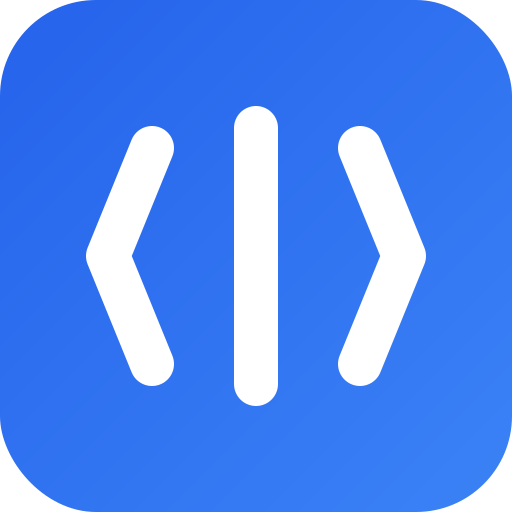
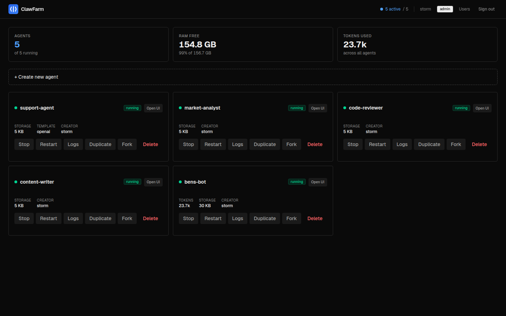
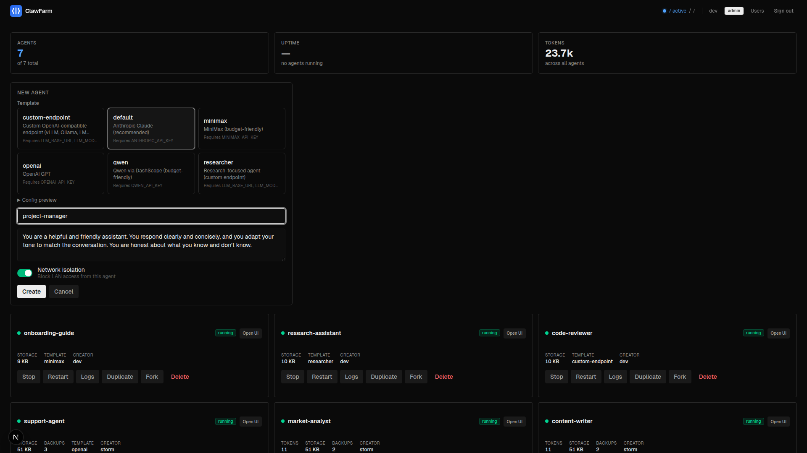

<p align="center">
  
</p>

<h1 align="center">ClawFarm</h1>

<p align="center">
  Self-hosted fleet manager for <a href="https://github.com/openclaw/openclaw">OpenClaw</a> AI agents.
</p>

<p align="center">
  <a href="https://github.com/clawfarm/clawfarm/actions/workflows/ci.yml"></a>
  <a href="LICENSE"></a>
  <a href="https://github.com/clawfarm/clawfarm/releases"></a>
</p>

<p align="center">
  <a href="https://clawfarm.dev">Website</a>
</p>

<p align="center">
  
  <br>
  
</p>

OpenClaw is a powerful autonomous AI agent, but it's designed as a **single-operator personal assistant** — one gateway process, one admin, CLI-driven setup. Running multiple agents means manually provisioning each instance, managing separate configs, ports, and TLS certs, with no isolation between them.

ClawFarm wraps OpenClaw in operational infrastructure:

- **Container isolation** — each agent runs in its own Docker container and network. Agents can't see each other, and LAN access is blocked by default via per-bot iptables rules. Disable per-agent if needed.
- **Web dashboard** — create, start/stop, duplicate, fork, and delete agents from a browser instead of the command line.
- **Multi-user RBAC** — different users own different agents, with per-agent access control enforced at the reverse proxy layer.
- **Backup & rollback** — scheduled hourly backups with retention policies and one-click restore per agent.
- **Zero-config HTTPS** — Caddy handles TLS termination with path-based routing (`/claw/{name}/`) under a single port. Four modes: auto-generated self-signed, Let's Encrypt, custom certs, or plain HTTP behind a proxy.
- **Web terminal** — interactive shell into any running agent container, directly from the dashboard. No SSH or `docker exec` needed.
- **Monitoring** — CPU, memory, storage, and token usage per agent from the dashboard.
- **Templates** — define reusable agent configurations with `{{ENV_VAR}}` substitution. Create new agents in seconds.

Think of it as **Portainer for OpenClaw** — the AI capabilities are 100% OpenClaw, ClawFarm just makes running a fleet of them manageable.

## Quick Start

```bash
# 1. Clone & configure
git clone https://github.com/clawfarm/clawfarm && cd clawfarm
cp .env.example .env
# Edit .env with your LLM provider details (see Provider Setup below)

# 2. Launch
docker compose up -d

# 3. Open https://<your-ip>:8443
# Check logs for admin password: docker compose logs dashboard | head -20
```

That's it — no TLS certificates to generate, no Docker GID to look up. Caddy auto-generates a self-signed certificate and the dashboard auto-detects Docker socket permissions.

## Deployment Modes

ClawFarm supports four TLS modes via the `TLS_MODE` env var:

### Internal (default) — LAN / IP access

Zero-config TLS. Caddy auto-generates a self-signed certificate. Your browser will show a security warning — accept it to proceed.

```env
TLS_MODE=internal     # or just leave it unset
CADDY_PORT=8443
```

### ACME — Public domain with Let's Encrypt

Automatic certificate provisioning and renewal. Requires a public domain pointing to your server and port 80 accessible for ACME challenges.

```env
TLS_MODE=acme
DOMAIN=farm.example.com
CADDY_PORT=443
# ACME_EMAIL=you@example.com   # Optional — for expiry notifications
```

### Custom — Your own certificates

Use your own TLS certificates (existing PKI, corporate CA, etc).

```env
TLS_MODE=custom
CADDY_PORT=8443
```

Place your cert and key at `certs/cert.pem` and `certs/key.pem`:

```bash
mkdir -p certs
# Copy your cert files, or generate self-signed:
openssl req -x509 -newkey ec -pkeyopt ec_paramgen_curve:prime256v1 -nodes \
  -keyout certs/key.pem -out certs/cert.pem -days 3650 \
  -subj "/CN=ClawFarm" \
  -addext "subjectAltName=IP:$(hostname -I | awk '{print $1}'),IP:127.0.0.1,DNS:localhost"
```

### Off — Behind an upstream proxy

Plain HTTP. Use when ClawFarm sits behind nginx, Traefik, Cloudflare, etc. that handles TLS.

```env
TLS_MODE=off
CADDY_PORT=8080
PORTAL_URL=https://farm.example.com   # Your proxy's external URL (for CORS + redirects)
```

## Provider Setup

### Built-in Providers (Anthropic, OpenAI)

Use the `default` or `openai` template — just set the API key:

```env
ANTHROPIC_API_KEY=sk-ant-...    # for the "default" template
OPENAI_API_KEY=sk-...           # for the "openai" template
```

### OpenAI-Compatible Endpoints (vLLM, Ollama, OpenRouter, etc.)

Use the `custom-endpoint` template with three env vars:

```env
LLM_BASE_URL=http://10.0.0.5:8000/v1   # any /v1/chat/completions endpoint
LLM_MODEL=Qwen3.5-122B-A10B
LLM_API_KEY=none                         # or your API key
LLM_CONTEXT_WINDOW=262144               # optional (default: 128000)
LLM_MAX_TOKENS=8192                      # optional (default: 8192)
```

This works with any OpenAI-compatible server — vLLM, Ollama, LiteLLM, OpenRouter, etc.

## Bot Templates

Templates live in `bot-template/`. Each is a directory containing:

- `openclaw.template.json` — OpenClaw config with `{{ENV_VAR}}` placeholders
- `SOUL.md` — Bot personality
- `template.meta.json` — Display metadata (description, env hints for the dashboard)

Select the matching template when creating a bot in the dashboard.

| Template | Provider | Required env vars |
|----------|----------|-------------------|
| `default` | Anthropic (built-in) | `ANTHROPIC_API_KEY` |
| `openai` | OpenAI (built-in) | `OPENAI_API_KEY` |
| `minimax` | MiniMax (OpenAI-compatible) | `MINIMAX_API_KEY` |
| `qwen` | Qwen/DashScope (OpenAI-compatible) | `QWEN_API_KEY` |
| `custom-endpoint` | Any OpenAI-compatible server | `LLM_BASE_URL`, `LLM_MODEL`, `LLM_API_KEY` |
| `researcher` | Custom endpoint + web search | `LLM_BASE_URL`, `LLM_MODEL`, `LLM_API_KEY`, `BRAVE_API_KEY` |

**Built-in provider templates** (default, openai) use OpenClaw's native provider integration — just set an API key. **OpenAI-compatible templates** (minimax, qwen, custom-endpoint) connect to any `/v1/chat/completions` endpoint. Create new templates by copying an existing one and editing.

## Configuration

All configuration is via environment variables in `.env`. See `.env.example` for the full list with documentation.

Key variables:

| Variable | Description |
|----------|-------------|
| `LLM_BASE_URL` | LLM API endpoint |
| `LLM_MODEL` | Model name |
| `LLM_API_KEY` | API key |
| `TLS_MODE` | TLS mode: `internal` (default), `acme`, `custom`, `off` |
| `DOMAIN` | Public domain (for `acme` mode) |
| `CADDY_PORT` | Listening port (default: 8443) |
| `PORTAL_URL` | External base URL override (auto-derived in most modes) |
| `BRAVE_API_KEY` | Brave Search API key for agent web search |
| `BACKUP_INTERVAL_SECONDS` | Scheduled backup interval (default: 3600, 0 = disabled) |
| `AUTH_DISABLED` | Set to `1` to skip authentication |

## Architecture

```
Browser → Caddy (TLS + auth) → Dashboard (FastAPI) → Bot containers (OpenClaw)
                               ↕
                          Docker socket
```

- **Caddy** — TLS termination, path-based routing, forward_auth
- **Dashboard** — FastAPI backend managing bot lifecycle via Docker API
- **Frontend** — Next.js dashboard UI
- **Bot containers** — OpenClaw instances, one per agent, isolated networks

All services run as Docker containers via `docker-compose.yml`. Bot data persists on the host filesystem under `bots/`.

## Network Isolation

Each bot runs on its own Docker bridge network. The `network/setup-isolation.sh` script applies iptables rules so bots can reach the internet and the LLM server, but cannot access the LAN or each other.

## Development

```bash
# Build from source (instead of pulling pre-built images)
docker compose -f docker-compose.dev.yml up --build -d

# Or run services directly for hot-reload:
# Backend
python -m venv .venv && source .venv/bin/activate
uv pip install -e ".[dev]"
cd dashboard && uvicorn app:app --host 0.0.0.0 --port 8080 --reload

# Frontend (separate terminal)
cd frontend && npm install && npm run dev

# Tests
cd dashboard && uv run pytest tests/ -v
```

## Documentation

| Guide | Description |
|-------|-------------|
| [Deployment](docs/deployment.md) | TLS modes, upstream proxy setup, port architecture |
| [Templates & Providers](docs/templates-and-providers.md) | LLM provider setup, template structure, custom templates |
| [Backups & Rollback](docs/backups-and-rollback.md) | Scheduled backups, retention, rollback flow |
| [Roles & Access Control](docs/roles-and-access.md) | User roles, per-bot RBAC, session management |

## Releasing

See [RELEASING.md](RELEASING.md) for the release process and Docker image publishing.
